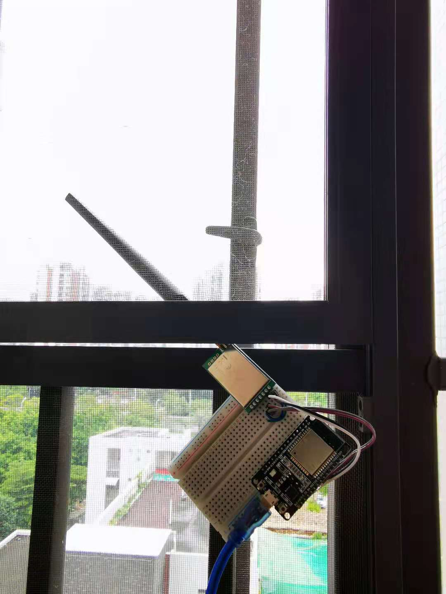
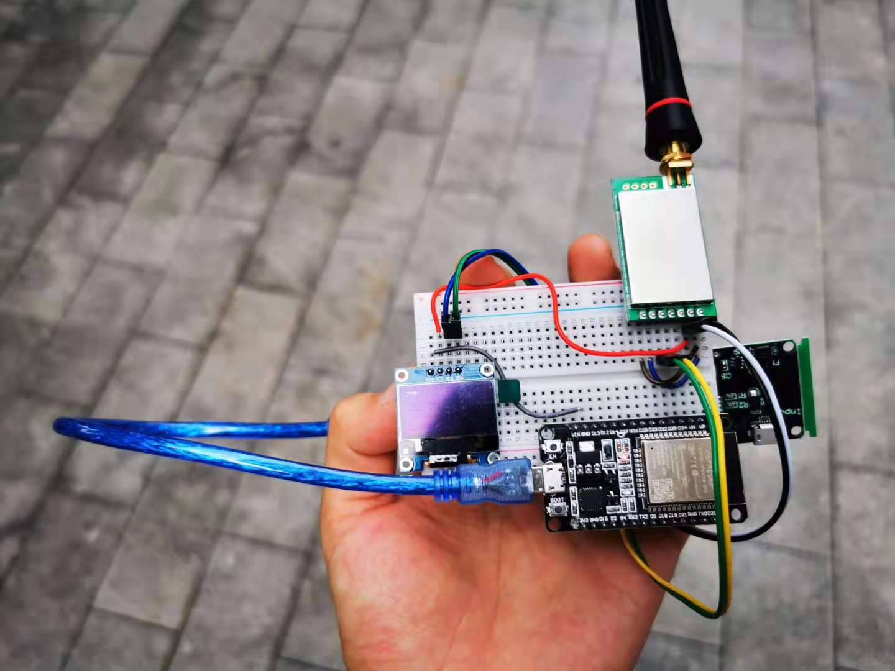

# LoRa Module Sender Receiver

## Background
    The Radio modules I used previously were HC-12, which were not so satisfying. In previous tests, the signal could not penetrate the walls of just one single contrete-structured building.

    I had to test out something else.

## Hardware Introduction

### Parts used:

- MCU:

    ESP32 DevKit 

- LoRa Module:

    The LoRa modules I used this time is a pair of  `E32-433T30D1B`, which was bought from https://www.taobao.com The website is the domestic version of AliExpress.


### Sender
 The sender device has the module connected to Serial2 of UART at TXD and RXD pins.

 


### Receiver
 The device has an i²C OLED screen that is connected to
 pin 21(SDA) and pin 22(SCL), along side with the LoRa module connected to UART at Serial2, just like the sender.

 


## Code Insights


### Folder Structure
 
Because the ArduinoIDE doesn't allow .ino sketches outside of a folder that has a different name. Although I wanted to use a folder called "shared_utils" for headers that are used repeatedly, I wasn't able to do that. The IDE complains that no file found when using "../" relative paths.

 
- root directory
  - receiver

    - receiver.ino

    - utils

      -  bytes_to_int.h
      -  oled_utils.h
      -  radio_transceiver_utils.h
    
  - sender

    - sender.ino

    - utils

        - int_to_bytes.h
        - radio_transceiver_utils.h


### Sender Sketch & Utils
In the sketch you can find the following code which sets up the sender. Which is encapsulated function that was written in `"radio_transceiver_utils.h"` :


```c++
void setup()
{
  Serial.begin(115200); // First Step(important)

  transceiver_setup();
}
```


